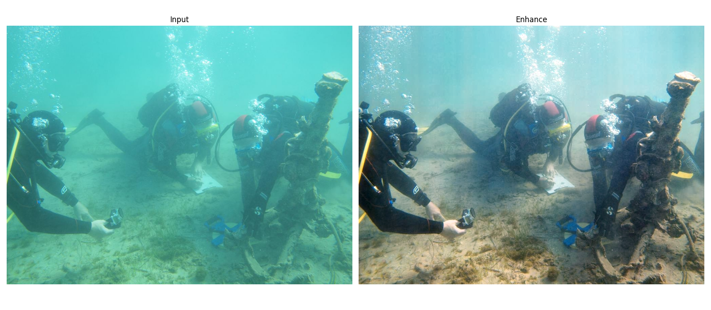

<div align="center">
<h2>🔎 HCLR-Net</h2>
</div>


#  Introduction
<div align="center">

</div>

## 📝 Note 
- This is a personal implementation of [HCLR-Net](https://link.springer.com/article/10.1007/s11263-024-01987-y), based on the [official implementation](https://github.com/zhoujingchun03/HCLR-Net).
- Compared with the official implementation, this implementation supports full-size evaluation instead of images with fixed resolution.
### 1. Installation
- **Clone the repo**:
    ```
    git clone https://github.com/xigua7105/HCLR-Net.git
    cd HCLR-Net
    ```

- **Environment setup**: HCLR-Net works with Python 3.8+ and PyTorch 2.0+.
    ```
    conda create -n HCLR python=3.8
    conda activate HCLR
    pip install -r requirements.txt
    ```

### 2. QuickStart
- To quickly enhance an underwater image, run:
    ```
     python demo_image.py
    ``` 
- To quickly enhance an underwater video, run:
    ```
     python demo_video.py
    ``` 
- Train your model:
  ```
  python run.py --c configs/train/HCLR-Net.yaml --mode train
  ```
- Test your model:
  ```
  python run.py --c configs/test/HCLR-Net-Test.yaml --mode test
  ```
#  Implementation Details
## 💿 Datasets
### 💡 We expect the directory structure to be the following:

-
  ```
  path/to/dataset/
  |---train
  |   |---LSUI/
  |   |   |---input
  |   |   |---target
  |   |---UIEB/
  |       |---input
  |       |---target
  |
  |---test/
  |   |---LSUI/
  |   |   |---input
  |   |   |---target
  |   |---UIEB/
  |       |---input
  |       |---target
  |   |---EUVP/
  |       |---input
  |       |---target
  ```
 
- ⬇️ Download dataset from [LSUI](https://lintaopeng.github.io/_pages/UIE%20Project%20Page.html), [UIEB](https://li-chongyi.github.io/proj_benchmark.html) and [EUVP](https://irvlab.cs.umn.edu/resources/euvp-dataset).

## 📝 Configs
- More details see [this](configs/train/HCLR-Net.yaml) and [DLTrainer](https://github.com/xigua7105/DLTrainer).


## 👍 Acknowledgements
- This repo is mainly built on open repo [DLTrainer](https://github.com/xigua7105/DLTrainer) and [HCLR-Net official implementation](https://github.com/zhoujingchun03/HCLR-Net). 
- Thanks to these open-source repositories for their contribution to advancing the development of underwater image enhancement.
